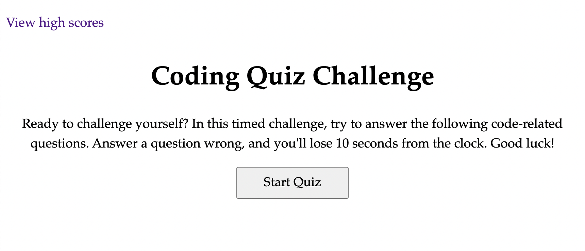

# quizzical_balderdash
Test your coding knowledge with this quiz.

Welcome to my silly named repo. In an effort to be unique in its name and to stand out among the crowd, I have overused the thesaurus for each repo. And in this case, we landed on Quizzical Balderdash ... as in a silly quiz. :) 

## Description

A 10 question coding quiz, with 60 seconds to answer. Each wrong answer subtracts 10 seconds from the clock. 

## Usage
Deployed code at [Quizzical Balderdash](https://savannahvel.github.io/quizzical_balderdash/)

## License
Please refer to the LICENSE in the repo.